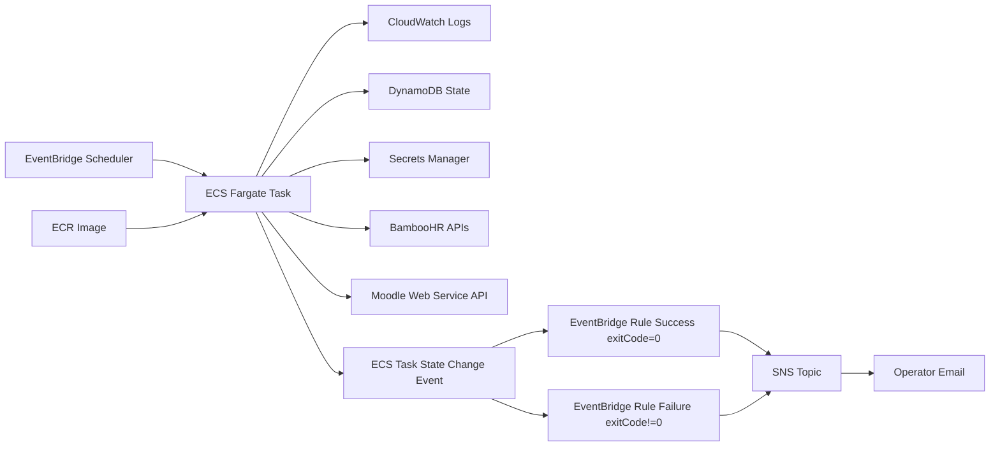

# BambooHR -> NovaLXP (Moodle) Sync on AWS

This repository deploys and runs a scheduled sync service that:
- reads BambooHR employee changes,
- maps employee attributes from BambooHR directory data,
- creates/updates/suspends users in NovaLXP (Moodle),
- resumes safely after downtime using DynamoDB state.

## Documentation Split
- `README.md` (this file): architecture, AWS resources, code design, config model.
- `RUNBOOK.md`: operator procedures (run, monitor, troubleshoot, recovery).

## Architecture

## AWS Resources (CloudFormation)
Template: `infra/template.yaml`

- `AWS::ECR::Repository`
  - Container registry for sync image (`:latest`).
- `AWS::ECS::Cluster`
  - Runtime cluster for Fargate tasks.
- `AWS::ECS::TaskDefinition`
  - Defines CPU/memory, env vars, IAM roles, logs.
- `AWS::Logs::LogGroup`
  - `/ecs/<ProjectName>` task output and JSON summary.
- `AWS::DynamoDB::Table`
  - State row keyed by `StateId`, storing `since`, `offset`, `updatedAt`.
- `AWS::SecretsManager::Secret` (2)
  - `<ProjectName>/bamboohr` with `bamboohr_api_key`.
  - `<ProjectName>/moodle` with `moodle_token`.
- `AWS::SNS::Topic` + `AWS::SNS::Subscription`
  - Email notifications.
- `AWS::Scheduler::Schedule`
  - Cron trigger for nightly task run.
- `AWS::Events::Rule` (2)
  - Success rule: ECS `STOPPED` + `exitCode=0` -> SNS simple success message.
  - Failure rule: ECS `STOPPED` + `exitCode!=0` -> SNS simple failure message.
- IAM roles (least privilege)
  - Task execution role: pull image + write logs.
  - Task role: DynamoDB state + read secret values.
  - Scheduler role: `ecs:RunTask` and `iam:PassRole` for task roles.

## Sync Procedure (Code Behavior)
Implementation: `app/sync.py`

1. Load config from environment variables.
2. Read BambooHR and Moodle credentials from Secrets Manager.
3. Read state row from DynamoDB:
   - `{ since, offset }`
   - if missing, initialize `since = now - INITIAL_LOOKBACK_DAYS`, `offset = 0`.
4. Call BambooHR changed endpoint using `since`.
5. Call BambooHR directory endpoint once; build employee lookup map.
6. Select processing window:
   - `BATCH_SIZE > 0`: process `changes[offset:offset+BATCH_SIZE]`
   - `BATCH_SIZE <= 0`: process all remaining `changes[offset:]`
7. For each selected record:
   - build identity fields,
   - detect inactive/deleted -> suspend behavior,
   - lookup Moodle user by `idnumber` (then email fallback),
   - update existing user or create new user (`auth=oidc`).
8. State advancement rules:
   - if **no errors** and batch not complete: keep `since`, increase `offset`.
   - if **no errors** and batch complete: set `since=latest`, reset `offset=0`.
   - if **any error**: keep `since` and `offset` pinned for retry.
9. Print one JSON summary to stdout and exit:
   - `0` when `errors == 0`
   - `1` when `errors > 0`

## External API Requirements
### BambooHR
- API key user must have permission to read:
  - changed employee feed,
  - directory data for in-scope employees.

### Moodle
Token must allow:
- `core_user_get_users` (primary lookup)
- `core_user_get_users_by_field` (fallback for some environments)
- `core_user_create_users`
- `core_user_update_users`

Also ensure the token user has capabilities to read/create/update users.

## Key Parameters
- `ProjectName`
- `VpcId`, `SubnetIds`, `SecurityGroupId` (public networking in this deployment)
- `ScheduleExpression` (cron)
- `ScheduleTimezone` (IANA tz, e.g. `Europe/London`)
- `BatchSize` (`0` = unlimited per run)
- `InitialLookbackDays` (used only when state row does not yet exist)
- `AlertEmail`
- `BambooCompanyDomain`
- `MoodleBaseUrl`

Example dev params file: `infra/params.dev.json`

## Repository Layout
- `app/sync.py`: sync worker
- `app/Dockerfile`: runtime container
- `app/requirements.txt`: Python dependencies
- `infra/template.yaml`: service infrastructure
- `infra/create_public_vpc.sh`: optional public VPC bootstrap
- `infra/params.dev.json`: parameter example
- `RUNBOOK.md`: operations guide

For operations, use `RUNBOOK.md`.
